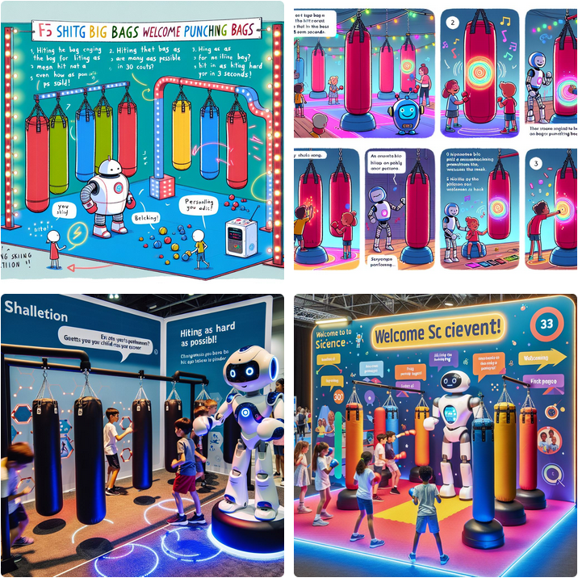
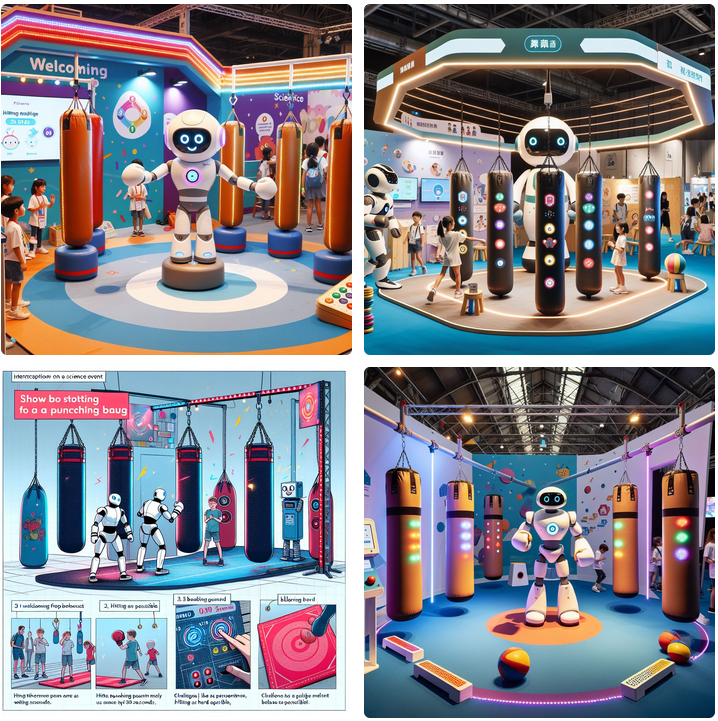

# PunchPal
*Made with* ❤ *by Bas Baccarne & Jamil Joundi*  
*Supported with*🔥 *by Jeroen Bougonjon, Line Winey, Margot Bulcke, Maike Somers, Renée Bultijnck & Emma Tack*  
*A [comon](http://www.comon.gent) project, built for [Dag van de Wetenschap 2024](https://www.dagvandewetenschap.be/)*    
   
An interactive installation using punching bags and a robot to engage kids in fun physical challenges and provide personalized activity advice

#  Short term action points
- [ ] Margot/Maike: Buy a pilot punch bag
- [ ] Jeroen/Renée/Emma: Identify most appropriate challenges
- [ ] Jeroen/Renée/Emma: Identify most appropriate personalized advice
- [ ] Jeroen/Bas/Jamil: Figure out Dwengo ~ Arduino communication

# General goals
* The goal of this installation is to create an engaging and interactive installation that raises awareness about the importance of physical activity, especially in complex situations like recovering after cancer treatment.
* It is designed for young children, approximately 8 years old, and should be fun and quick to participate in.
* The core of the installation consists of **five big punching bags** equipped with velostat sensors and an Arduino to read and send data, combined with a [Dwengo](https://www.dwengo.org/) robot.
* When a child punches a bag, a **robot** welcomes them in a playful way and presents a series of challenges. These challenges include hitting the bag as many times as possible in 30 seconds, hitting as hard as they can, and following specific rhythms or patterns.
* The robot provides real-time feedback through sounds and LED strips, making the experience engaging and motivating.
* After completing the challenges, the robot assesses the child's capabilities and preferences based on the collected data. It then provides **personalized advice** on physical activities that match the child's abilities.
* The installation also includes playful physical activities for the **waiting queue**, such as a balancing board and hopscotch, to keep children entertained while they wait.
* The project aims to make physical activity enjoyable and educational, promoting fitness and recovery awareness among young children.
* Overall, the installation combines fun, education, and technology to create a memorable and impactful experience for the children.

# Storyboard
* **Introduction**: As children approach the installation, they see five big punching bags arranged in a row. A friendly robot sits next to the bags, ready to welcome them.
* **Welcome**: When a child punches a bag, the robot comes to life with a playful greeting. It introduces itself and explains the fun challenges ahead. The robot's voice is cheerful and encouraging, making the children feel excited to participate.
* **Challenge 1 - Speed**: The robot asks the child to hit the bag as many times as possible in 30 seconds. The punching bag is equipped with velostat sensors and an Arduino to measure the number of hits. The LED strips light up with each punch, and the speaker cheers them on with sounds like "aw" and "oh yeah." The robot provides real-time feedback, encouraging the child to keep going.
* **Challenge 2 - Strength**: Next, the robot challenges the child to hit the bag as hard as they can. The sensors measure the force of each punch, and the LED strips change colors based on the intensity of the punches, providing visual feedback. The robot praises the child's strength and motivates them to give their best effort.
* **Challenge 3 - Coordination**: The robot introduces a coordination challenge, such as hitting the bag in a specific rhythm or pattern. The LED strips guide the child with changing colors, and the robot provides instructions and encouragement. This challenge helps improve the child's timing and coordination skills.
* **Challenge 4 - Endurance**: The final challenge tests the child's endurance by asking them to keep punching the bag for a set period. The robot and LED strips provide continuous encouragement, and the speaker plays upbeat music to keep the child motivated. The sensors track the child's performance throughout the challenge.
* **Assessment**: After the challenges, the robot processes the data collected from the punching bags. It then provides personalized advice on physical activities that match the child's capabilities and preferences. The advice is delivered in a fun and encouraging way, suggesting activities like dancing, playing tag, or simple exercises.
* **Conclusion**: The robot thanks the child for participating and encourages them to stay active. It also provides a brief educational message about the importance of physical activity, especially in recovery situations. The robot's message is designed to be both informative and motivating.
* **Waiting Queue Activities**: To keep the children entertained while waiting for their turn, the installation includes playful physical activities such as a balancing board, hopscotch, and a mini obstacle course. These activities help keep the children engaged and active, even while they wait.

# Benchmarks 4 inspiration
* [DIY Smart Punching Bag](https://www.instructables.com/Smart-Punching-Bag/)
* [Project HitBox](https://projects.learningplanetinstitute.org/projects/hitbox-interactive-boxing-bag/description)
* [Padipata Interactive Punching Bag](https://www.facebook.com/GIGadgets.Fans/videos/1075264679489205/)
* [Interactive Inflatable Punch Bag for Kids](https://rainbowcolours.com/products/interactive-inflatable-led-musical-punch-bag?srsltid=AfmBOorio1E10Jz_inflCE2i_M-X3OUl_Oub8z6nl7XFRLsQSvkXiS3e)
* [IMU based Punching Pole](https://www.instructables.com/Interactive-Reflex-Bag/) [Variant 2](https://www.instructables.com/Pressure-Punch-Final-Project/)
  
# Components
Waiting cue (ideation)
* Balance board(s)
* Bridges
* Tunnels
* Jumping spots (different color patterns)
* Stretching station
* Web structure to climb through

Punching bag
* Velostat (temporary: [RP-S40-ST Thin Film Pressure Sensor](https://www.dfrobot.com/product-1842.html))
* 2x [Arduino Nano ESP32](https://store.arduino.cc/en-be/products/nano-esp32-with-headers) 
* [LED strip](https://www.dfrobot.com/product-1835.html)
* Audio Driver with SD card ([DFPlayer](https://www.dfrobot.com/product-1121.html)) + SD card
* [Speaker](https://www.dfrobot.com/product-1506.html) (<3W)
* Power
* Punching bag

Robot
* Dwengo robot
* Casing for the robot

# Subchallenges
Before creating the final prrototypes, we solve a couple of subchallenges
- [ ] Calibrate sensor and trigger on punch
- [ ] Send trigger from Arduino A to Arduino B over BLE
- [ ] Reveive trigger and play a sound
- [ ] Do some stuff with the LED strip
- [ ] Build a state machine
