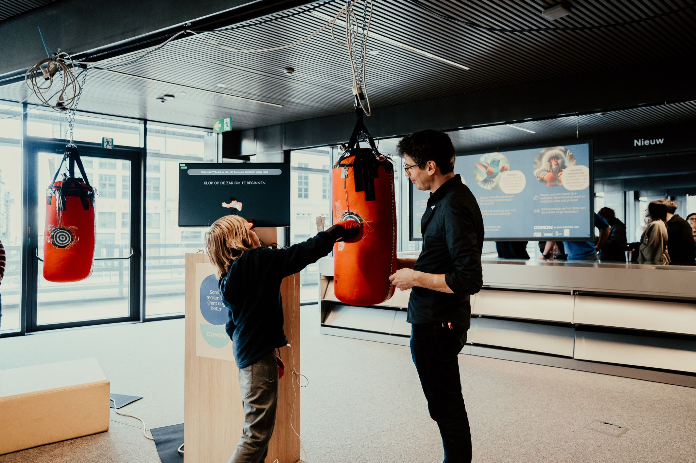
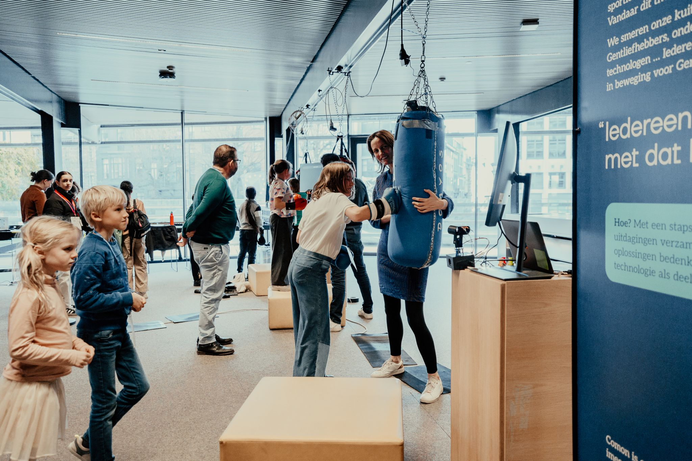
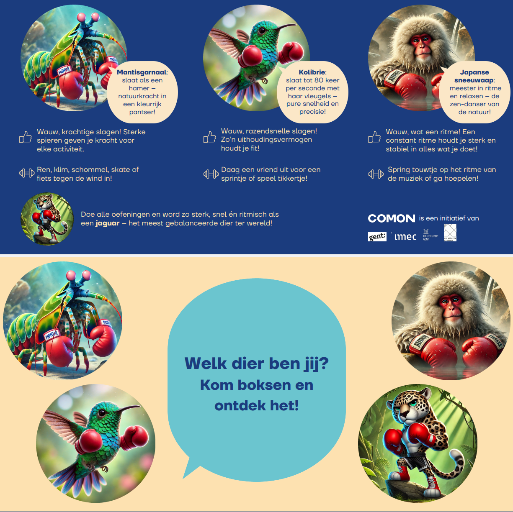

# PunchPal
*Tinkered with* ❤ *by Bas Baccarne, Jamil Joundi, Tom Neutens & Alexander Mol*   
*Supported with*🔥 *by Jeroen Bougonjon, Line Winey, Margot Bulcke, Maike Somers, Stephanie Van Hove, Franziska Burger, Dorien Goubert, Nell van Hanseweyck, Renée Bultijnck & Emma Tack*  
<br>
*A [comon](http://www.comon.gent) project, built for [Dag van de Wetenschap 2024](https://www.dagvandewetenschap.be/)    ([24 november 2024](https://comon.gent/evenement/kom-boksen-met-robots-op-dag-van-de-wetenschap))*
***
<div align="center">  
   
  
</div>

***
**Punchpal is an interactive installation using punching bags and a robot to engage kids in fun physical challenges and provide personalized activity advice**
***
# General goals
* The goal of this installation is to create an engaging and interactive installation that raises awareness about the importance of physical activity, especially in complex situations like recovering after cancer treatment.
* It is designed for young children, approximately 8 years old, and should be fun and quick to participate in.
* The core of the installation consists of **three big punching bags** equipped with sensors and an Arduino to read and send data, combined with a motivating robot.
* When a child punches a bag, a **robot** welcomes them in a playful way and presents a series of challenges. These challenges include hitting the bag as many times as possible in 30 seconds, hitting as hard as they can, and following specific rhythms or patterns.
* The robot provides real-time feedback through sounds and LED strips, making the experience engaging and motivating.
* After completing the challenges, the robot assesses the child's capabilities and preferences based on the collected data. It then provides **personalized advice** on physical activities that match the child's abilities.
* The installation also includes playful physical activities for the **waiting queue**, such as a balancing board and hopscotch, to keep children entertained while they wait.
* The project aims to make physical activity enjoyable and educational, promoting fitness and recovery awareness among young children.
* Overall, the installation combines fun, education, and technology to create a memorable and impactful experience for the children.

# Storyboard
## Pre-game
* **Waiting Queue Activities**: To keep the children entertained while waiting for their turn, the installation includes playful physical activities such as a balancing board, hopscotch, and a mini obstacle course. These activities help keep the children engaged and active, even while they wait.
* The children pick up a number from the ticket dispenser
* A big screen shows who's turn it is next, and at the same time gives movement challenges
## Main game
* **Introduction**: As children approach the installation, they see 3 big punching bags hanging in the mdidle of the room. 
* **Welcome**: When a child punches a bag, the robot comes to life with a playful greeting. It introduces itself and explains the fun challenges ahead. The robot's voice is cheerful and encouraging, making the children feel excited to participate.
* **Challenge 1 - Strength**: the robot challenges the child to hit the bag as hard as they can. The sensors measure the force of each punch, and the LED strips change colors based on the intensity of the punches, providing visual feedback. The robot praises the child's strength and motivates them to give their best effort. 
* **Challenge 2 - Speed**: The robot asks the child to hit the bag as many times as possible in 30 seconds. The punching bag is equipped with velostat sensors and an Arduino to measure the number of hits. The LED strips light up with each punch, and the speaker cheers them on with sounds like "aw" and "oh yeah." The robot provides real-time feedback, encouraging the child to keep going.
* **Challenge 3 - Rhythm**: The final challenge tests the child's ability to keep a steady rhytm.
* **Conclusion**: After the challenges, the robot processes the data collected from the punching bags and gives ratings, visualised as 4 animals
    * `Mantis`: Force
    * `Hummingbird`: Speed
    * `Japanese snow monkey`: rhytm
    * `Jaguar`: generalist
## Post-game
* The children can then go to a big **billboard** which shows information on the perfomance and provides personalized advice on physical activities that match the child's capabilities and preferences
  
# Components
## Pre-game
The waiting cue is a playfull arena. Children can take a number from a [ticket dispenser](https://www.amazon.com.be/-/en/CYSSJF-Number-Ticket-Dispenser-Waiting/dp/B0BBVB9T41/ref=asc_df_B0BBVB9T41/). A screen shows the number of the next participant who can enter the boxing ring. Meanwhile, the screen also shows (in an alternating way) (1) information on the importance of physical activity and (2) movement advice. There is no cue, but waiting participants are challenged to exercise while waiting.  

- [x] [List of activities](content/Input%20Emma%20Tack.docx)
- [X] [Ticket dispenser](https://www.amazon.com.be/-/nl/nummerdispenser-wandankerhouder-nummersysteem-deurinstallatiesystemen-INTERNATIONAL/dp/B08NW6LV42/ref=asc_df_B08NW6LV42/?tag=begogshpadd0d-21&linkCode=df0&hvadid=714473552846&hvpos=&hvnetw=g&hvrand=16276129641215346199&hvpone=&hvptwo=&hvqmt=&hvdev=c&hvdvcmdl=&hvlocint=&hvlocphy=1001228&hvtargid=pla-1157752077288&psc=1&mcid=38ea6b2bdddd3091a15afb6feddee7aa&gad_source=1)
- [X] [Protopie for the screen](pies/counter.pie)
- [X] Arena delineation (poles & ribbons)

<div align="center">
   
</div>

## Main game
### Punching bag
The punching bag is a boxing bag, hung at the ceiling with strong magnets, with power coming from above.  A microcontroller on the top is powered through a 5V power adapter. The punch bag detects punches using its onboard IMU. This force is processed in 3 ways: 
1.  The force drives the led strip. A led strip op 120 leds is wrapped around the punch bag. From the middle the leds flare out at both sides. The bigger the punch, the wider the leds spread out.
2.  The force triggers sound effects. Whenever a puch is detected a sound effect is played.
3.  The force is send over BLE to be processed by the robot control center.

#### Hardware components
* [Arduino Nano 33 IOT](https://store.arduino.cc/en-be/products/arduino-nano-33-iot?srsltid=AfmBOoqs3picykI2RmGLFcmqDr-7JXn37wr0dZKpgsBNeWgEOX8gPXjQ)
* [Big Pressure Detector - RP-S40-ST](https://www.amazon.com.be/-/en/dp/B07H35RZCT?ref=ppx_yo2ov_dt_b_fed_asin_title)
* [WS2812 RGB LED strip](https://www.dfrobot.com/product-1835.html)
* [Audio Driver with SD card (DFPlayer)](https://www.dfrobot.com/product-1121.html) + SD card with [audio files](mp3/soundfx)
* [Speaker](https://www.dfrobot.com/product-1506.html) (<3W)
* [Punching bag](https://www.decathlon.be/fr/p/sac-de-frappe-poing-14-kg-rouge/_/R-p-331858?mc=8651245&srsltid=AfmBOorR6KR3TMO4XhtYN0VpDQgSnXRjlLiIrg5T-x6PiLyhr9W8kmmJ0rI)
* 5V Power adapter (> 1A) + power connector
* Some resistors, jumper cables & breadboard(s)
  
#### Code & casing
* 💼 [Casing](https://a360.co/40fPP0c)
* ⌨️ [Punch bag code & wiring](main/punchbag.ino)

### Robot
The robot is a 3D printed robot with a moving head and LED eyes. The robot processes the data from the punch bag and speaks to the kids ([inspired by this guy](https://www.youtube.com/watch?v=6P0FF4LY1e4)). In entais the following components:
1. It receives punch readings from the punchbag
2. It moves its head
3. It has LED controlled eyes
4. It speaks to the users
5. It controls a screen with extra information
6. It processes the data (depending on the state)
7. It manages the states of the interaction
   
The robot can be in the following states: 

1.  `BOOTING`: the start up and calibration state, right after the robot is turned on
2.  `IDLE`: the initial state, waiting for a signal to start
3.  `WELCOME`: the state where the robot welcomes the user and gives the first instructions
4.  `CHALLENGE1`: the first challenge state (punch as hard as you can)
5.  `CHALLENGE1_DEBRIEF`: the debrief state after the first challeng
6.  `CHALLENGE2`: the second challenge state (punch as fast as you can)
7.  `CHALLENGE2_DEBRIEF`: the debrief state after the second challenge
8.  `CHALLENGE3`: the third challenge state (punch as accurate/steady as you can)
9.  `CHALLENGE3_DEBRIEF`: the debrief state after the third challenge
10.  `CONCLUSION`: the final state, where the robot gives the final instructions and the user can leave > goes back the IDLE state

#### Hardware components
* [Arduino Nano 33 IOT](https://store.arduino.cc/en-be/products/arduino-nano-33-iot?srsltid=AfmBOoqs3picykI2RmGLFcmqDr-7JXn37wr0dZKpgsBNeWgEOX8gPXjQ)
* [Audio Driver with SD card (DFPlayer)](https://www.dfrobot.com/product-1121.html) + SD card with [audio files](mp3/boxy)
* [Speaker](https://www.dfrobot.com/product-1506.html) (<3W)
* 2 x [9g microservo](https://www.robotshop.com/products/feetech-9g-digital-servo-22kg-cm-fs90mg)
* 2 x [Adafruit Mini 8x8 LED Matrix w/I2C Backpack](https://www.adafruit.com/product/870)
* Some jumper cables, resistors and a breadboard

#### Code & casing
* 💼 [Casing](https://a360.co/4fcM1B4)
* ⌨️ [Robot code & wiring](main/robot)
  
<div align="center">

</div>

### Robot Assistant Screen
The screen is a protopie screen with extra text and information. The screens are triggered and 'data fed' thorugh serial messages of the robot arduino. This screen runs on a raspberry pi with and external screen.   
Variables:
- `state` (char): (see above) `BOOTING` `IDLE` `WELCOME` `CHALLENGE1` `CHALLENGE1_DEBRIEF` `CHALLENGE2` `CHALLENGE2_DEBRIEF` `CHALLENGE3` `CHALLENGE3_DEBRIEF`& `CONCLUSION`
- `punchforce` (float): measurement from the bag
- `subtitles` (char): character string with the robot voice in text
- `max_force` (float): hardest hit (challenge 1)
- `punch_counter` (int): total hits (challenge 2)
- `punch_deviance` (float): delta between time interval T-(T-1) & (T-1)-(T-2)
- `punch_variance` (float): moving average of the delta (absolute values)
- `mantis` `hummingbird` `maki` & `jaguar` (int): animal scores (0 to 3 (stars))
- `final_animal` (char): final decision, which animal does best resemble you?

#### Hardware components
* Raspi or Computer
* Screen
* USB cable
* [Protopie File](pies/robotAssistant.pie)

### Post-game
With this conclusion the players can to to a screen with extra information.

<div align="center">
  
</div>

***

# Transfer to Processing
For a more autonomous installation, we transformed the installation to an independently running set-up in which we replace the laptop with Protopie by a `Raspberry Pi Zero W` with `Processing`.   

Status:   
* The **Zero W V1.1**'s latency is a problem. We'll need to try with the 2 or a full raspberry
* Also, Processing might not be the best solution: over to **PyGame**. An initial benchmark seems give better results.
* [PyGame benchmark code](/python/src/benchmark.py)
* Current setup: Raspi 3 + pygame

## Processing experiment

Extra materials:
* Raspberry Pi Zero W
* Raspberry Pi Screen (HDMI)

Processing Code
* ⌨️ [Processing code](processing)

Set-up:
* Burn a fresh image on the raspi zero W. There is an image with processing preinstalled ([download here](https://github.com/processing/processing/releases/download/processing-0265-3.4/processing-3.4-linux-raspbian.zip))
* This image only runs Processing 3. Older raspberry Pies don't have the latsts Java versions required for scripts in Processing 4
* SSH into the raspi and get system up to date (-Y says yes to every question, can take a while)
    ```
    sudo apt update   
    sudo apt upgrade -y
    ```
* Compile code in Processing 3 and export for Linux

* You'll need the `application.linux-armv6hf` for the Raspi Zero W

* Upload the Processing code in a logical place
    * In this case `home/io/processing/punchpal`
    * I'm using [WinSCP](https://winscp.net/) for file transfer

* If you want a faster system, you can burn a Raspi Lite version
    * But you'll need to install the lastst java version   
    `sudo apt install openjdk-17-jdk`
    * You'll also need the UI elements, since the system won't work in the UI   
    `sudo apt-get install raspberrypi-ui-mods`
    * set the system to boot in the GUI mode   
    `sudo raspi-config`
    * reboot   
    `reboot`
    * check java install   
    `java -version`
    * download and unzip Processing 3 in the /opt folder (4 doesn't work on old Pies)   
    `wget https://github.com/processing/processing/releases/download/processing-0269-3.5.3/processing-3.5.3-linux-armv6hf.tgz`   
    `tar -xvzf processing-3.5.3-linux-armv6hf.tgz`
    * install required libraries
    * go to the processing folder and run the script   
   `sh processing-java --sketch=/home/io/processing/main/  --present`

* Testrun:   
    ```
    cd /users/io/processing/punchpal
    source punchpal
    /opt/processing/processing-java --sketch=/users/io/processing/punchpal --run
    ```

## Pygame experiment 1.1
The goal remains the same: For a more autonomous installation, we transformed the installation to an independently running set-up in which we replace the laptop with Protopie by a `Raspberry Pi Zero W 1.1` with `PyGame`. The Zero W1.1 has very limited capacities and has to do some graphical stuff. That's why we chose PyGame over tKinter, Kivy & Qt (PyQt/PySide).

It's challenging to create a fluid interface on the Zero W. The code can contribute to a better UX:
* Lower the resolution (this has the biggest impact)
* Double buffering
* Don't call `pygame.display.update()` more than needed (once per frame)
* Reduce the color depth
* Use hardware accelleration (not realy helping on the zero W)

* Optimize the framerate
* Keep the main loop as efficient as possible

Extra materials:
* [Raspberry Pi Zero W](https://www.raspberrypi.com/products/raspberry-pi-zero-w/)
* [Raspberry Pi Screen (HDMI)](https://www.raspberrypi.com/products/raspberry-pi-monitor/)

Set-up:
* Burn a fresh image on the raspi zero W. *Raspberry Pi OS Lite* works best for the Zero W.
* SSH into the raspi and get system up to date (-Y says yes to every question, can take a while)
    ```
    sudo apt update   
    sudo apt upgrade -y
    ```

* Confirm installation of Python and pip
    ```
    sudo apt install python3 python3-pip
    ```
* You might get some issues with missing graphical libraries, therefore:
    ```
    sudo apt-get install libsdl2-2.0-0 libsdl2-dev libsdl2-ttf-2.0-0
    ```

* Set-up a project folder, e.g. `pi/punchpal`
* Download the loading script and main program in `/punchpal/src`

* Create and start a virtual environment
    ```
    cd ~/punchpal
    python3 -m venv venv
    source venv/bin/activate
    ```

* Install required libraries
    ```
    pip install -r requirements.txt
    ```
* test run of the py scripts
    ```
    python animated_text.py
    ```

This is still challenging on the raspi zero W. With a resulution of 1280x720 the test script barely reaches 20 FPS. Although we could improve the hardware, it's challenging to explore how far we can get with the raspi zero W 1.1. Next up the exploration list (1) Pyglet end (2) Arcade. Since Phyglet has better support for animated GIFs & video, let's start there.


## Pygame experiment 1.2
- Insight: The zero W is still not powerfull enough
- Swithing to RPI3 (same processor as zero 2W)
- Fresh install pi OS (with GUI)   
    ```console
    sudo apt update
    sudo apt upgrade -y
    ```
- Pygame and Python normally come preinstalled; get latest version & check
    ```console
    mkdrir punchpal
    cd punchpal
    python3 -m venv venv
    source venv/bin/activate
    python3 -m pip install -U pygame
    python3 -m pygame.examples.aliens
    ```
- Sync the github page
    ```console
    git clone https://github.com/basbaccarne/dagvandewetenschap2024
    ```
- Required libraries
    ```console
    pip3 install pyserial
    ```
- Run the main PyGame script
    ```console
    python3 dagvandewetenschap2024/python/src/main.py
    ```


   
# Subchallenges
Before creating the final prototypes, we solve a couple of subchallenges
- [x] Punch: Simple **velostat** test & 3.3V optimiziation ([test](tests/punch%20simple%20velostat.ino))
- [X] Punch: **Calibrate** sensor and trigger on punch ([test](tests/punch.ino))
- [x] Punch: Play a **sound** ([sound tests](tests/DFplayer.ino))
- [x] Punch: **Led strip** [punch test](tests/LEDstrip_punchtest.ino) & [simple rainbox test](tests/LEDstrip_rainbowtest.ino)
***
- [X] Commz: Send data from Arduino A to Arduino B over **UART** ([master](tests/UART_master.ino) & [slave](tests/UART_master.ino))
- [X] Commz: Send data from Arduino A to Arduino B over **BLE** ([sender](tests/BLE_sender.ino) & [receiver](tests/BLE_receiver.ino)) ([simple demo sender](tests/BLE_sender_v2.ino))
- [X] Commz: Send data from Arduino A to Arduino B over **HC-05** (Bluetooth) ([sender](HC05_sender.ino) & [receiver](tests/HC05_receiver.ino))
- [X] Commz: Send data from Arduino A to Arduino B over **HTTP** ([server](tests/WiFi_sender.ino) & [client](tests/WiFi_recevier.ino)) 
---
- [X] Robot: Anthropomorphic stuff with two **8x8 led matrices** ([eyes](tests/anthro_eyes.ino))
- [X] Robot: **servo** mounts ([head movement](tests/anthro_headmovement.ino))([simple test script to test if the servo is still working](tests/servo_tester.ino))
- [X] Robot: [**integrated** head movement & eye movement](tests/robot_intergration.ino)
- [x] Robot: Reveive trigger and play a **sound** ([sound tests](tests/DFplayer.ino) // [sound tests with status pin](tests/DFplayer_with_status.ino))
- [X] Robot: [outer **casing**](https://a360.co/4fcM1B4)
---
- [X] Extra screen: show stuff using **Protopie** with [Serial Communication](pies/robotAssistant.pie)
---
- [x] [**State machine**](tests/statemachine_simplesycle.ino)
- [x] [**.h and .cpp** test](tests/multifilescripting)
      
# Benchmarks 4 inspiration
* [DIY Smart Punching Bag](https://www.instructables.com/Smart-Punching-Bag/)
* [Project HitBox](https://projects.learningplanetinstitute.org/projects/hitbox-interactive-boxing-bag/description)
* [Padipata Interactive Punching Bag](https://www.facebook.com/GIGadgets.Fans/videos/1075264679489205/)
* [Interactive Inflatable Punch Bag for Kids](https://rainbowcolours.com/products/interactive-inflatable-led-musical-punch-bag?srsltid=AfmBOorio1E10Jz_inflCE2i_M-X3OUl_Oub8z6nl7XFRLsQSvkXiS3e)
* [IMU based Punching Pole](https://www.instructables.com/Interactive-Reflex-Bag/) [Variant 2](https://www.instructables.com/Pressure-Punch-Final-Project/)
